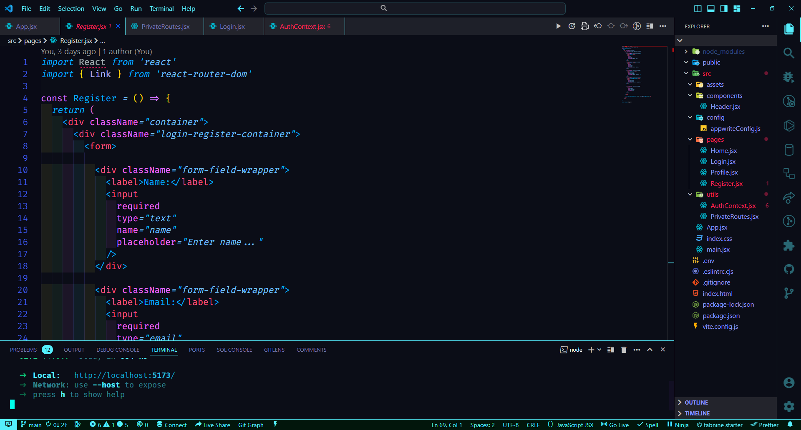

# README

## Welcome to the README for "Cyan Bact Theme" Extension

Thank you for choosing our "Cyan Bact Theme" extension for your Visual Studio Code editor. This theme is designed to bring a refreshing and stylish cyan-themed experience to your coding environment. Here's everything you need to know to make the most out of this extension:

## Preview
- Just a preview of the theme, code is not required

### Features

- **Cyan-inspired**: Immerse yourself in a calming and energizing cyan color palette that makes coding a pleasure.

- **Readable Syntax Highlighting**: We've carefully selected syntax highlighting colors that ensure your code is not only beautiful but also easily readable.

- **Italics for Emphasis**: Certain keywords are displayed in italics to make them stand out and catch your attention effortlessly.

- **Terminal Elegance**: Enjoy a terminal with a semi-transparent black background, providing a blend of style and legibility.

### Installation

1. Open Visual Studio Code.

2. Navigate to the Extensions view by clicking on the Extensions icon in the Activity Bar on the side of the window or use the shortcut `Ctrl+Shift+X`.

3. Search for "Cyan Bact Theme" and click on the Install button.

4. Once installed, click on the gear icon in the lower left corner and select "Color Theme". Choose "Cyan Bact Theme" from the list.

5. Your Visual Studio Code environment will now be transformed with the fresh and vibrant Cyan Bact Theme.

### Feedback and Contributions

We value your feedback and suggestions. If you encounter any issues, have enhancement ideas, or want to contribute, please feel free to reach out to us on our GitHub repository: [Cyan Bact Theme GitHub](https://github.com/rajjitlai/CyanoBactTheme)

### Spread the Word

If you enjoy using the Cyan Bact Theme, we'd appreciate it if you could help us spread the word. Share it with your friends and colleagues, and leave a review on the Visual Studio Code Marketplace.

Thank you for choosing "Cyan Bact Theme" to enhance your coding experience. We hope you enjoy the vibrant colors and elegant design that our theme brings to your workspace.

## 💰You can help me by Donating

  

Happy Coding! 🎉
